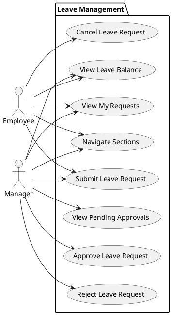
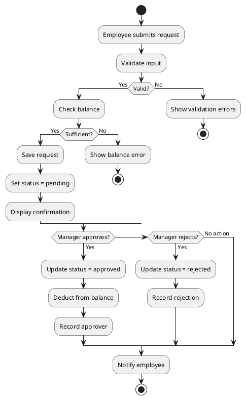

# ksf_Leave_UI - Use Case Specification

## Document Information

| Field | Value |
|-------|-------|
| **Document ID** | UCD-LEAVE-001 |
| **Module** | ksf_Leave_UI |
| **Project** | Leave Management System |
| **Version** | 1.0.0 |
| **Author** | KS Fraser Development Team |
| **Created** | 2024-01-15 |

---

## 1. Use Case Overview

### 1.1 Actor Definitions

| Actor | Description | Access Level |
|-------|-------------|---------------|
| **Employee** | Standard user who can submit and view their own leave requests | SA_LEAVE |
| **Manager** | Employee with supervisory role, can approve/reject requests from reports | SA_LEAVE + SA_LEAVEAPPROVE |
| **HR Admin** | Human Resources staff with full leave management access | SA_LEAVE + SA_LEAVEAPPROVE |
| **System** | Automated processes (notifications, scheduled tasks) | System |

### 1.2 Use Case Summary

| UC ID | Use Case Name | Primary Actor | Priority |
|-------|---------------|---------------|----------|
| UC-001 | Submit Leave Request | Employee | High |
| UC-002 | View Leave Balance | Employee | High |
| UC-003 | View My Requests | Employee | High |
| UC-004 | Cancel Leave Request | Employee | Medium |
| UC-005 | View Pending Approvals | Manager | High |
| UC-006 | Approve Leave Request | Manager | High |
| UC-007 | Reject Leave Request | Manager | High |
| UC-008 | Navigate Leave Sections | Employee/Manager | Medium |

---

## 2. Use Case Details

### 2.1 UC-001: Submit Leave Request

**Primary Actor**: Employee  
**Secondary Actors**: System (for notification)  
**Priority**: High  
**Pre-condition**: User is authenticated and has valid employee ID

#### Description
Employee submits a new leave request specifying dates, type, and optional notes.

#### Pre-Conditions
1. User is logged into FrontAccounting
2. User has an associated employee record
3. User has SA_LEAVE permission
4. Leave types are configured in the system

#### Basic Flow
```
1. Employee navigates to Leave Management page
2. System displays default "My Requests" section
3. Employee clicks "New Request" button
4. System displays leave request form
5. Employee selects leave type from dropdown
6. Employee enters start date
7. Employee enters end date
8. System calculates number of days
9. Employee optionally enters notes
10. Employee clicks "Submit" button
11. System validates all input fields
12. System checks available balance
13. System creates leave request record with status='pending'
14. System displays success message with request ID
15. System refreshes requests list
```

#### Alternative Flows

**AF-001: Validation Error**
```
11a.1. System detects invalid input
11a.2. System displays error messages for each invalid field
11a.3. System retains form values
11a.4. Employee corrects errors
11a.5. Resume from step 11
```

**AF-002: Insufficient Balance**
```
12a.1. System calculates available balance for selected leave type
12a.2. Available balance < requested days
12a.3. System displays error: "Insufficient leave balance"
12a.4. Employee adjusts dates or selects different leave type
12a.5. Resume from step 11
```

**AF-003: Cancel Submission**
```
10a.1. Employee clicks "Cancel" button
10a.2. System discards form data
10a.3. System returns to My Requests view
```

#### Post-Conditions
**Success**:
- New leave request record exists in database
- Request status is 'pending'
- Employee can see request in their history

**Failure**:
- No record created
- User remains on form with error messages

#### Business Rules
| Rule ID | Rule Description |
|---------|------------------|
| BR-001 | Start date must be today or future |
| BR-002 | End date must be >= start date |
| BR-003 | Requested days must not exceed available balance |
| BR-004 | Half-day leave supported (0.5 days) |
| BR-005 | Notes field limited to 500 characters |

---

### 2.2 UC-002: View Leave Balance

**Primary Actor**: Employee  
**Priority**: High  
**Pre-condition**: User is authenticated with valid employee ID

#### Description
Employee views their current leave entitlements and remaining balances.

#### Pre-Conditions
1. User is logged into FrontAccounting
2. User has an associated employee record
3. User has SA_LEAVE permission
4. Leave balance records exist for current year

#### Basic Flow
```
1. Employee navigates to Leave Management page
2. Employee clicks "Leave Balance" tab
3. System retrieves leave balance records for employee
4. System calculates remaining for each leave type
5. System displays balance table with columns:
   - Leave Type
   - Entitlement
   - Used
   - Remaining
6. Employee views their balances
```

#### Post-Conditions
- Balance information displayed accurately
- Values match calculated formula: Remaining = Entitlement - Used

#### Business Rules
| Rule ID | Rule Description |
|---------|------------------|
| BR-006 | Balance calculated using current calendar year |
| BR-007 | Only approved requests count as "used" |
| BR-008 | Cancelled requests do not affect balance |
| BR-009 | Carry-forward from previous year included |

---

### 2.3 UC-003: View My Requests

**Primary Actor**: Employee  
**Priority**: High  
**Pre-condition**: User is authenticated

#### Description
Employee views a list of all their submitted leave requests.

#### Pre-Conditions
1. User is logged into FrontAccounting
2. User has SA_LEAVE permission

#### Basic Flow
```
1. Employee navigates to Leave Management page
2. System defaults to "My Requests" tab
3. System retrieves all leave requests for employee
4. System displays requests in table with columns:
   - Type
   - Dates
   - Days
   - Status
5. System displays most recent requests first
```

#### Post-Conditions
- All employee's requests are visible
- No other employees' requests are displayed

---

### 2.4 UC-004: Cancel Leave Request

**Primary Actor**: Employee  
**Priority**: Medium  
**Pre-condition**: User has pending request

#### Description
Employee cancels one of their pending leave requests.

#### Pre-Conditions
1. User is logged into FrontAccounting
2. User has at least one request with status='pending'
3. Request start date is in the future

#### Basic Flow
```
1. Employee views their request list
2. Employee clicks "Cancel" on pending request
3. System displays confirmation dialog
4. Employee confirms cancellation
5. System updates request status to 'cancelled'
6. System displays success message
7. System refreshes request list
```

#### Alternative Flows

**AF-004: Dismiss Confirmation**
```
4a.1. Employee clicks "No" or dismisses dialog
4a.2. System returns to request list
4a.3. No changes made
```

#### Post-Conditions
- Request status changed to 'cancelled'
- Request remains in database for audit
- No balance adjustment made

#### Business Rules
| Rule ID | Rule Description |
|---------|------------------|
| BR-010 | Only pending requests can be cancelled |
| BR-011 | Cannot cancel requests already started |
| BR-012 | Cancellation is irreversible |

---

### 2.5 UC-005: View Pending Approvals

**Primary Actor**: Manager  
**Priority**: High  
**Pre-condition**: User has approval permission

#### Description
Manager views all leave requests awaiting their approval.

#### Pre-Conditions
1. User is logged into FrontAccounting
2. User has SA_LEAVEAPPROVE permission
3. There are pending requests to review

#### Basic Flow
```
1. Manager navigates to Leave Management page
2. Manager clicks "Pending Approval" tab
3. System verifies SA_LEAVEAPPROVE permission
4. System retrieves all requests with status='pending'
5. System displays pending requests table with columns:
   - Employee
   - Type
   - Dates
   - Days
   - Action (Approve/Reject links)
6. System displays oldest requests first
```

#### Alternative Flows

**AF-005: No Pending Requests**
```
5a.1. No requests found with status='pending'
5a.2. System displays empty state message
5a.3. Message: "No pending requests to review"
```

#### Post-Conditions
- All pending requests visible to manager
- Approve/Reject actions available for each

#### Business Rules
| Rule ID | Rule Description |
|---------|------------------|
| BR-013 | Manager sees requests from their direct reports |
| BR-014 | HR Admin sees all pending requests |
| BR-015 | Requests sorted by submission date ascending |

---

### 2.6 UC-006: Approve Leave Request

**Primary Actor**: Manager  
**Priority**: High  
**Pre-condition**: Manager viewing pending request

#### Description
Manager approves a pending leave request.

#### Pre-Conditions
1. User is logged into FrontAccounting
2. User has SA_LEAVEAPPROVE permission
3. Request exists with status='pending'

#### Basic Flow
```
1. Manager views pending requests list
2. Manager clicks "Approve" link on request
3. System validates manager's approval authority
4. System updates request status to 'approved'
5. System records approver ID and timestamp
6. System deducts days from employee's leave balance
7. System displays success message
8. System refreshes pending list (approved request removed)
```

#### Alternative Flows

**AF-006: Approval After Start Date**
```
3a.1. Request start date has already passed
3a.2. System warns manager: "This leave has already started"
3a.3. Manager confirms or cancels approval
3a.4. If confirmed: Continue with approval
```

#### Post-Conditions
- Request status changed to 'approved'
- Leave balance updated (days deducted)
- Approval record created with approver info

#### Business Rules
| Rule ID | Rule Description |
|---------|------------------|
| BR-016 | Approval action is immediate |
| BR-017 | Days deducted from balance upon approval |
| BR-018 | Approval timestamp recorded |
| BR-019 | Approver ID stored for audit |

---

### 2.7 UC-007: Reject Leave Request

**Primary Actor**: Manager  
**Priority**: High  
**Pre-condition**: Manager viewing pending request

#### Description
Manager rejects a pending leave request with optional reason.

#### Pre-Conditions
1. User is logged into FrontAccounting
2. User has SA_LEAVEAPPROVE permission
3. Request exists with status='pending'

#### Basic Flow
```
1. Manager views pending requests list
2. Manager clicks "Reject" link on request
3. System displays rejection dialog with optional comment field
4. Manager optionally enters rejection reason
5. Manager clicks "Confirm Reject"
6. System updates request status to 'rejected'
7. System records approver ID, timestamp, and reason
8. System displays success message
9. System refreshes pending list (rejected request removed)
```

#### Alternative Flows

**AF-007: Cancel Rejection**
```
5a.1. Manager clicks "Cancel" in dialog
5a.2. System dismisses dialog
5a.3. No changes made
```

#### Post-Conditions
- Request status changed to 'rejected'
- No balance deduction made
- Rejection reason stored for audit

---

### 2.8 UC-008: Navigate Leave Sections

**Primary Actor**: Employee/Manager  
**Priority**: Medium  
**Pre-condition**: User is on Leave Management page

#### Description
User navigates between different sections of the leave management interface.

#### Pre-Conditions
1. User is logged into FrontAccounting
2. User has SA_LEAVE permission

#### Basic Flow
```
1. User is on Leave Management page
2. User clicks navigation tab (My Requests, Pending Approval, Leave Balance)
3. System receives section parameter via URL (?section=value)
4. System validates user permission for requested section
5. System renders appropriate content
6. System updates active tab styling
```

#### Section Mapping
| URL Parameter | Section | Required Permission |
|--------------|---------|---------------------|
| `?section=requests` | My Requests | SA_LEAVE |
| `?section=pending` | Pending Approval | SA_LEAVEAPPROVE |
| `?section=balance` | Leave Balance | SA_LEAVE |

---

## 3. Data Requirements

### 3.1 Input Data Summary

| Use Case | Input Fields | Source | Required |
|----------|-------------|--------|----------|
| UC-001 | leave_type, start_date, end_date, days, notes | User Form | Yes |
| UC-003 | (none - uses session) | N/A | N/A |
| UC-004 | request_id | Click Action | Yes |
| UC-006 | request_id, approver_id | System/Session | Yes |
| UC-007 | request_id, approver_id, reason | System/Session | Partial |

### 3.2 Output Data Summary

| Use Case | Output | Destination |
|----------|--------|-------------|
| UC-001 | Confirmation message, request ID | Browser |
| UC-002 | Balance table | Browser |
| UC-003 | Requests table | Browser |
| UC-005 | Pending requests table | Browser |
| UC-006/007 | Success message, updated list | Browser |

---

## 4. Error Handling

### 4.1 Error Scenarios

| Scenario | Error Type | User Message | System Action |
|----------|------------|--------------|---------------|
| Invalid date format | Validation | "Invalid date format" | Highlight field |
| End before start | Validation | "End date must be after start date" | Highlight fields |
| Past start date | Validation | "Start date cannot be in the past" | Highlight field |
| Insufficient balance | Business | "Insufficient leave balance. Available: X days" | Show balance |
| No permission | Security | "You don't have permission to access this feature" | Show access denied |
| Request not found | System | "Leave request not found" | Show error |

### 4.2 Exception Handling

| Exception | Handler | Recovery |
|-----------|---------|----------|
| Database connection failure | Display error page | Retry with backoff |
| Session expired | Redirect to login | Re-authenticate |
| Invalid employee ID | Display error | Contact admin |

---

## 5. Use Case Diagrams

### 5.1 Employee Use Cases



### 5.2 Business Process Flow



---

## 6. Requirements Traceability

| Use Case ID | Functional Requirements | Test Cases |
|-------------|------------------------|------------|
| UC-001 | FR-001, FR-003 | TC-001, TC-003 |
| UC-002 | FR-002 | TC-002 |
| UC-003 | FR-001 | TC-001 |
| UC-004 | FR-004 | TC-004 |
| UC-005 | FR-005 | TC-005 |
| UC-006 | FR-006 | TC-006 |
| UC-007 | FR-007 | TC-007 |
| UC-008 | FR-008 | TC-008 |

---

**Document Owner**: KS Fraser Development Team  
**Review Status**: Pending